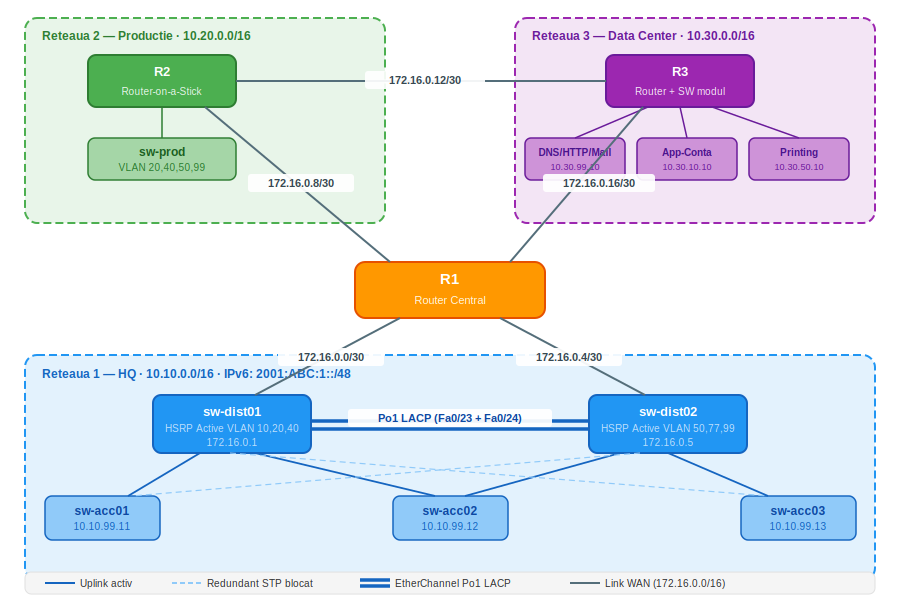

# 🌐 Proiect CCNA — Telacad SRL
### Infrastructura de Retea Enterprise in Cisco Packet Tracer


---

## 📋 Descriere

Proiect CCNA complet implementat in **Cisco Packet Tracer**, acoperind o topologie de tip enterprise cu **3 retele distincte** interconectate printr-o arhitectura redundanta si scalabila.

Proiectul acopera toate temele principale din cursul CCNA:
VLANuri, EtherChannel, HSRP, STP, Router-on-a-Stick, Static Routing, DHCP, DNS, HTTP, Email si IPv6.

---

## 🗺️ Topologie



---

## 🔧 Tehnologii Implementate

| Tehnologie | Detalii |
|---|---|
| **VLANuri** | 6 VLANuri pe HQ, 4 pe Productie |
| **EtherChannel LACP** | Po1 — Fa0/23 + Fa0/24 intre sw-dist01 si sw-dist02 |
| **HSRP** | Load balancing pe 6 VLANuri, failover < 3 secunde |
| **STP** | Redundanta uplink pe switch-urile de acces |
| **Router-on-a-Stick** | R2 cu subinterface per VLAN |
| **Static Routing** | Sumarizare /16, rutare redundanta spre HQ |
| **DHCP** | Alocare dinamica pentru VLAN 50 (Printing), redundant pe ambele MLS |
| **DNS** | proiect-ccna.com, www, mail, scenarii |
| **HTTP** | Server web cu doua pagini |
| **Email** | SMTP/POP3 cu conturi dedicate per departament |
| **IPv6 SLAAC** | Dual-stack pe toate dispozitivele, adrese automate pe PC-uri |

---

## 🏗️ Structura Retelei

### Reteaua 1 — HQ (SwitchBlock)
**Adresare:** `10.10.0.0/16` | **IPv6:** `2001:ABC:1::/48`

| VLAN | Nume | Subnet | Gateway HSRP |
|---|---|---|---|
| 10 | Contabilitate | 10.10.10.0/24 | 10.10.10.1 |
| 20 | Vanzari | 10.10.20.0/24 | 10.10.20.1 |
| 40 | Productie | 10.10.40.0/24 | 10.10.40.1 |
| 50 | Printing | 10.10.50.0/24 | 10.10.50.1 |
| 77 | HR | 10.10.77.0/24 | 10.10.77.1 |
| 99 | Management | 10.10.99.0/24 | 10.10.99.1 |

**HSRP Load Balancing:**
- `sw-dist01` Active: VLAN 10, 20, 40
- `sw-dist02` Active: VLAN 50, 77, 99

### Reteaua 2 — Productie (Router-on-a-Stick)
**Adresare:** `10.20.0.0/16` | **IPv6:** `2001:ABC:2::/48`

| VLAN | Nume | Subnet | Gateway |
|---|---|---|---|
| 20 | Vanzari | 10.20.20.0/24 | 10.20.20.1 |
| 40 | Productie | 10.20.40.0/24 | 10.20.40.1 |
| 50 | Printing | 10.20.50.0/24 | 10.20.50.1 |
| 99 | Management | 10.20.99.0/24 | 10.20.99.1 |

### Reteaua 3 — Data Center
**Adresare:** `10.30.0.0/16` | **IPv6:** `2001:ABC:3::/48`

| Server | IP | Servicii |
|---|---|---|
| DNS / HTTP / Mail | 10.30.99.10 | DNS, HTTP, SMTP, POP3 |
| App-Conta | 10.30.10.10 | Aplicatie Contabilitate |
| Printing | 10.30.50.10 | Server Print |

### Linkuri WAN

| Link | Subnet |
|---|---|
| R1 ↔ sw-dist01 | 172.16.0.0/30 |
| R1 ↔ sw-dist02 | 172.16.0.4/30 |
| R1 ↔ R2 | 172.16.0.8/30 |
| R2 ↔ R3 | 172.16.0.12/30 |
| R1 ↔ R3 | 172.16.0.16/30 |

---

## 🔁 Redundanta

| Mecanism | Timp Failover | Descriere |
|---|---|---|
| **HSRP** | < 3 secunde | Failover automat al gateway-ului |
| **STP** | ~30 secunde | Deblocarea portului redundant |
| **EtherChannel Po1** | Instantaneu | Failover pe linkul ramas activ |
| **Rutare redundanta** | Instantaneu | Failover pe ruta alternativa catre R1 |

---

## 📧 Serviciul Email

Fiecare departament are un cont dedicat:

| Cont | Departament | Retea |
|---|---|---|
| conta@proiect-ccna.com | Contabilitate | Reteaua 1 |
| vanzari@proiect-ccna.com | Vanzari | Reteaua 1 |
| prod@proiect-ccna.com | Productie | Reteaua 2 |
| hr@proiect-ccna.com | HR | Reteaua 1 |

Comunicarea functioneaza intre toate cele 3 retele.

---

## 🌍 Servicii Web

- 🌐 **Pagina principala** → [www.proiect-ccna.com](web/index.html)
- 📋 **Scenarii testare** → [scenarii.proiect-ccna.com](web/scenarii.html)

> **GitHub Pages** (dupa activare):
> - https://stanescu151191.github.io/proiect-ccna-telacad/web/index.html
> - https://stanescu151191.github.io/proiect-ccna-telacad/web/scenarii.html
---

## 🧪 Scenarii de Testare

### Scenariu 1 — HSRP Failover
```
1. show standby brief  →  sw-dist01 Active pe VLAN 10,20,40
2. Oprire interfata Gi0/1 pe sw-dist01
3. sw-dist02 preia automat rolul Active pe toate VLANurile
4. Pierdere maxim 2-3 pachete in momentul failover
5. sw-dist01 revine  →  recapata Active prin preempt
```

### Scenariu 2 — STP Failover
```
1. show spanning-tree vlan 10  →  Fa0/24 Altn BLK
2. Deconectare fizica Fa0/23 (uplink primar)
3. STP deblocheaza Fa0/24 dupa ~30 secunde
4. Conectivitate restabilita automat
```

### Scenariu 3 — Rutare Redundanta
```
1. show ip route  →  doua rute spre 10.10.0.0/16
2. Oprire Gi0/1 pe sw-dist01
3. R1 foloseste automat ruta via sw-dist02
4. Zero pierderi de pachete
```

### Scenariu 4 — EtherChannel Failover
```
1. show etherchannel summary  →  Po1(SU) Fa0/23(P) Fa0/24(P)
2. Oprire Fa0/23 pe sw-dist01
3. Po1 ramane SU dar doar cu Fa0/24(P)
4. Trafic continuat fara intrerupere pe Fa0/24
```

---

## 📁 Structura Repository

```
proiect-ccna-telacad/
│
├── README.md
├── topology.svg
├── topology.pkt
├── web/
│   ├── index.html
│   └── scenarii.html
└── screenshots/
    ├── hsrp_standby_brief.png
    ├── etherchannel_summary.png
    ├── stp_vlan10.png
    ├── ip_route_r1.png
    └── web_browser.png
```

---

## 🛠️ Tools Folosite

- **Cisco Packet Tracer 8.x**
- **Cisco IOS** — Switch 3650, Router 2911
- **Protocoale:** IEEE 802.1Q · IEEE 802.3ad LACP · HSRP · STP/RSTP · DHCPv4/v6 · DNS · SMTP · POP3

---

> *Proiect realizat in cadrul cursului CCNA — Telacad 2026*
